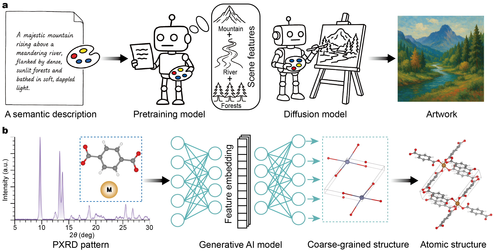
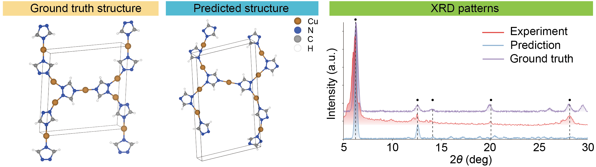

# Xrd2Mof

<div align="center">

[](LICENSE)

</div>

**Title.** *Interpreting X-Ray Diffraction Patterns of Metal-Organic Frameworks via Generative Artificial Intelligence*
**Authors.** Bin Feng1#, Bingxu Wang1#, Linpeng Lv1, Mingzheng Zhang1, Zhefeng Chen1, Feng Pan1*, Shunning Li1*

---

## Table of Contents

* [Introduction](#introduction)
* [Model Architecture](#model-architecture)
* [Getting Started](#getting-started)

  * [Prerequisites](#prerequisites)
  * [Data Processing](#data-processing)
  * [Feature Extraction](#feature-extraction)
  * [Coarse-Grained Structure Generation](#coarse-grained-structure-generation)
  * [Atomic MOF Assembly](#atomic-mof-assembly)
* [License](#license)
* [Acknowledgements](#acknowledgements)
* [Citation](#citation)

---

## Introduction

**Xrd2Mof** present a crystal structure generation framework based on the Stable Diffusion architecture designed to enable intelligent, high-throughput interpretation of powder X-ray diffraction (PXRD) patterns and subsequent reconstruction of atomic-level crystal structures for metal–organic frameworks (MOFs). It leverages pretrained models to extract salient features from PXRD spectra alongside essential prior information, facilitating the generation of structural building-block sites within the unit cell. Using experimental MOF structures from the Cambridge Structural Database (CSD) as the training dataset, and experimentally obtained PXRD patterns as test cases, we demonstrate that Xrd2Mof effectively captures spectral features, integrates physicochemical information from metal nodes and organic linkers, and subsequently generates the critical structural sites necessary for assembling complete atomic structures. By employing a coarse-grained(CG) strategy, Xrd2Mof effectively overcomes the limitations traditionally imposed by atom count in crystal structure prediction (CSP) tasks, thus enabling its broad applicability across diverse MOF domains. The proposed framework offers a novel technological route toward automated structural determination in high-throughput MOF experiments, significantly advancing the application of machine learning methods within analytical and structural chemistry.
> **Keywords:** metal–organic frameworks (MOFs), crystal structure prediction (CSP), powder X-ray diffraction (PXRD), interpretable ML.

---

## Model Architecture

A schematic of the overall Xrd2Mof pipeline:




Further details are provided in the accompanying [paper](https://github.com/PKUsam2023/Xrd2Mof) (We will update the link to the paper after publication.).

---

## Getting Started

### Prerequisites

Tested software versions:
```
Python>=3.8.5
torch>=1.13.1
numpy>=1.24.4
scikit-learn>=1.3.2
matplotlib>=3.7.5
```

Install dependencies:

```bash
pip install -r requirements.txt
```

We recommend the Anaconda distribution (Windows/macOS/Linux). Installation has been validated using the standard instructions from each provider.

**Optional data:** Preprocessed databases `linker_valence_table.pt` and `valid_bbs_space_408626.pt` are available on Zenodo.
For full data access, please contact: **[chenwei_wu@stu.pku.edu.cn](mailto:chenwei_wu@stu.pku.edu.cn)**.

---

### Data Processing

Create a test dataset following the steps in [`create_data/README.md`](create_data/README.md).

### Feature Extraction

Extract dataset features as described in [`pretrained_model/README.md`](pretrained_model/README.md).

### Coarse-Grained Structure Generation

Generate CG crystal structures following [`generation_model/README.md`](generation_model/README.md).

### Atomic MOF Assembly

Assemble atomic-level structures from CG predictions via [`assemble/README.md`](assemble/README.md).

---

## License

This project is released under the **MIT License**. See the [LICENSE](LICENSE) file for details.

---

## Acknowledgements

This codebase builds upon the following open-source projects and tools:

* [DiffCSP](https://github.com/jiaor17/DiffCSP)
* [MOFDiff](https://github.com/microsoft/MOFDiff)
* [Pymatgen](https://github.com/materialsproject/pymatgen)
* [PyTorch Geometric](https://github.com/pyg-team/pytorch_geometric)
* [PyTorch](https://github.com/pytorch/pytorch)
* [Lightning](https://github.com/Lightning-AI/pytorch-lightning/)
* [Hydra](https://github.com/facebookresearch/hydra)

We thank the authors and communities of these projects.

---

## Citation

If you use this repository or the pretrained models in your research, please cite:

**Bin Feng**, **Bingxu Wang**, L Lv, Mingzheng Zhang, Feng Pan* and Shunning Li*. Interpreting X-Ray Diffraction Patterns of Metal-Organic Frameworks via Generative Artificial Intelligence. 

> A BibTeX entry will be added here when a preprint/DOI becomes available.
